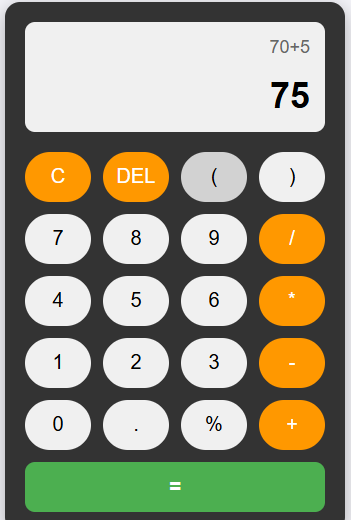
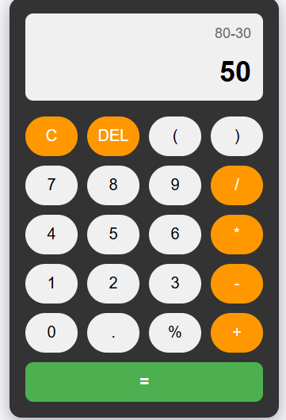
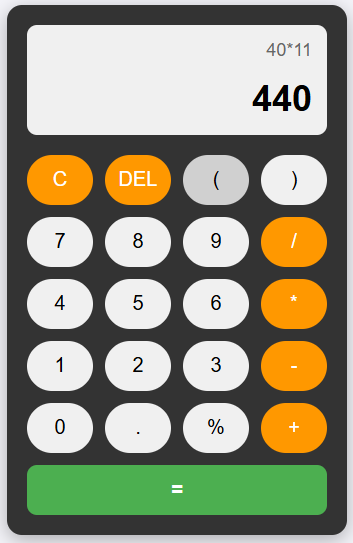
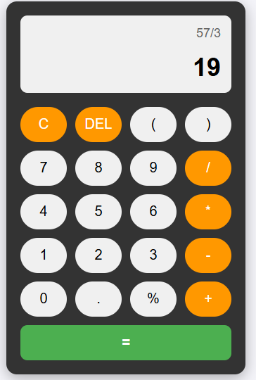

# Atividade de criação de calculadora - Desenvolvimento Web UNINOVE

Este projeto consiste em uma calculadora digital inspirada nas interfaces de smartphones modernos, desenvolvida utilizando **HTML5**, **CSS3** e **JavaScript (ES6)** como requisito prático para a **Aula 06**.

---

## Funcionalidades Implementadas

Além das quatro operações básicas solicitadas, o projeto foi refinado com melhorias reais de usabilidade (UX):
- **Quatro Operações Básicas:** Soma, subtração, multiplicação e divisão.
- **Funções Especiais:** Suporte a parênteses `( )` para precedência matemática e cálculo de porcentagem `%`.
- **Botão DEL (Backspace):** Apaga apenas o último caractere digitado, evitando ter que limpar toda a tela por um erro simples.
- **Transição de Display Inteligente (UX):** Enquanto o usuário digita, a expressão aparece com destaque na fonte principal (grande). Ao clicar em `=`, a operação "sobe" em tamanho reduzido e o resultado ganha o destaque central.
- **Trava de Segurança (Validação):** Implementação de uma Expressão Regular (Regex) que impede o cálculo caso o usuário aperte `=` sem digitar uma operação real (ex: digitar apenas `500 =` não dispara um cálculo falso).

---

## 🛠️ Detalhes da Implementação Técnica

### 1. Estrutura (HTML)
A interface foi mapeada no `index.html` organizando os botões dentro de um container principal. O display foi dividido em duas `divs` separadas para gerenciar o histórico da operação e o resultado de forma dinâmica.

### 2. Estilização (CSS)
Utilizei **CSS Grid Layout** para organizar a disposição dos botões em 4 colunas perfeitamente alinhadas, imitando o layout de um celular. Foram aplicados arredondamentos (`border-radius: 25px`) e efeitos de transição nos estados de `:hover` para melhorar o feedback visual dos cliques.

### 3. Lógica e Interatividade (JavaScript)
Seguindo os conceitos ensinados em aula, a lógica foi construída baseando-se em:
- **Manipulação do DOM:** Seleção dos elementos de tela via `getElementById` e dos botões via `querySelectorAll`.
- **Eventos:** Uso de `addEventListener('click', ...)` atrelado a uma estrutura de repetição `for...of` para monitorar todos os botões de forma limpa.
- **Processamento:** Uso da função nativa `eval()` encapsulada em blocos `try...catch` para evitar travamentos em caso de expressões matemáticas inválidas.

---

## 📸 Evidências de Funcionamento (Prints das Operações)

*Nota: Substitua os caminhos abaixo pelas capturas de tela geradas no seu ambiente.*

## 📸 Evidências de Funcionamento (Prints das Operações)

### 1. Operação de Soma

### 2. Operação de Subtração

### 3. Operação de Multiplicação

### 4. Operação de Divisão

---
© 2026 - Desenvolvido para a disciplina de Desenvolvimento Web - UNINOVE.